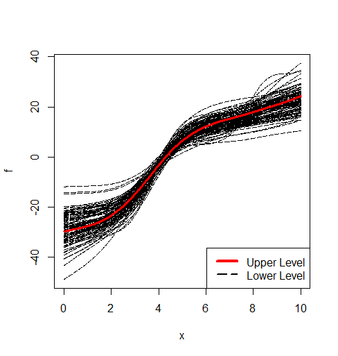

# HBSARSC v0.2.0
Hierarchical Bayesian Spectral Analysis Regression with Shape Constraints
## Authors
Peter Lenk, University of Michigan (plenk@umich.edu)<br/>
Jangwon Lee, Korea University (jangwonlee@korea.ac.kr) <br/>
Dongu Han, Korea University (idontknow35@korea.ac.kr) <br/>
Jichan Park, Korea University (2020020343@korea.ac.kr) <br/>
Taeryon Choi, Korea University  (trchoi@korea.ac.kr)
## Maintainer
Jangwon Lee, Korea University (jangwonlee@korea.ac.kr)
# Introduction
We propose an hierarchical Bayes (HB) model for functional data analysis where different groups have different flexible regression functions. We use HB Gaussian processes to model the functions at the lower-level (within groups) and upper-level (between groups). The spectral coefficients of the Gaussian processes have HB smoothing priors that serve two roles: they describe the heterogeneity in the spectral coefficients across groups, and they determine the smoothness of the flexible functions. The HB model is particularly appropriate when data within groups are sparse or do not cover the entire domain of the function. In these cases, the HB Gaussian model pools data across groups and relies on the upper-level model for estimation. Our model also allows shape constraints, such as monotonic functions. When appropriate, shape constraints drastically improve estimation with sparse data. 
# Example codes
Load the simulation data
```r
library(HBSARSC)

load("Simulation_1.rdata")

nbasis       = 20
iflagCenter  = 1
iflagHBsigma = 1
xmin         = 0
xmax         = 10
mcmc         = list(nblow0=1000,nblow=40000,smcmc=10000,nskip=1)

```
Fit the model with *increasing* shape constrained
```r
set.seed(1)
fout = hbsar(y=ydata, v=vdata, w=wdata, x=xdata, z=zdata, nbasis=nbasis, id_group=id_group, nint=500, 
             mcmc=mcmc, shape="Increasing", xmin=xmin, xmax=xmax,
             iflagCenter=iflagCenter, iflagHBsigma=iflagHBsigma)
```
Plot the posterior mean of the lower-level curves
```r
matplot(xgrid,cbind(fout$fxgridm,fout$f0xgridm),type="l",xlab="x",ylab="f",
        lwd=c(rep(1,fout$ngroup),3),lty=c(rep(5,fout$ngroup),1),
        col=c(rep("black",fout$ngroup),"red"))
legend("bottomright", legend=c("Upper Level","Lower Level"),col=c("red","black"),lty=c(1,5),lwd=c(4,2))
```

